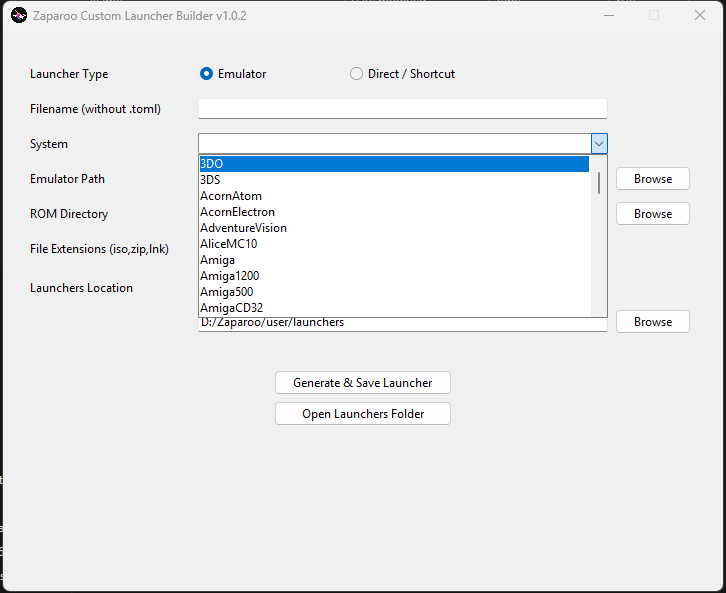

# Zaparoo Custom Launcher Builder

Zaparoo Custom Launcher Builder is a lightweight GUI tool for generating Custom Launcher files for Zaparoo.

Supports:
- Emulator launchers  
- RetroArch core launchers  
- Direct / shortcut launchers  

Simple, clean, repeatable launcher generation without manually editing TOML files.

---

## Download (Windows)

Download the latest automatic build:

| Platform | Status | Download |
|----------|--------|----------|
| Windows |  | [Download Pre-release](https://github.com/Anime0t4ku/zaparoo-custom-launcher-builder/releases/download/Pre-release/Zaparoo-Custom-Launcher-Builder-Windows-x86_64.zip) |

---

## Python Requirements

If running the script directly:

- Python 3.8+
- Tkinter (usually included)
- No external dependencies

Run with:

`python zaparoo-custom-launcher-builder.py`

---

## License

This project is licensed under the **GNU General Public License v2.0 (GPL-2.0)**.

See the `LICENSE` file for full details.
